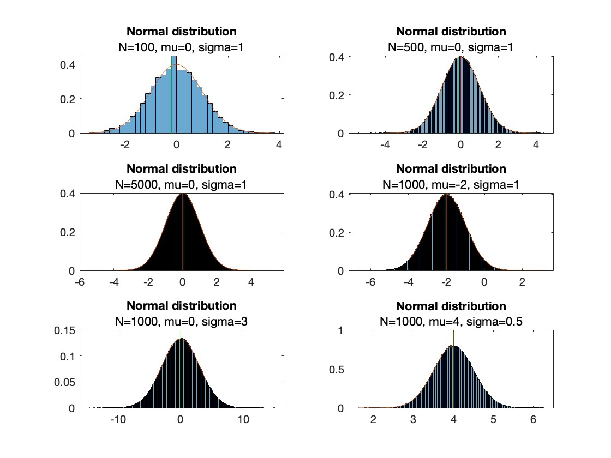
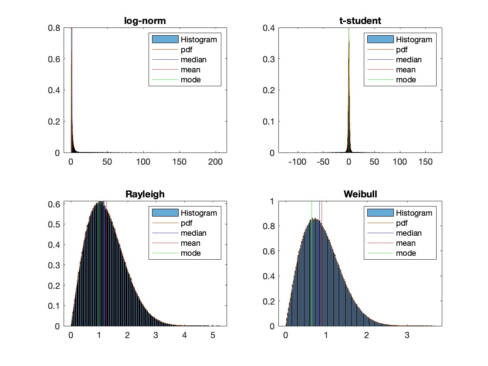

# Ejercicio 1, representar gaussianas.

```{r part1, echo=FALSE, fig.cap="Solución del problema 1", out.width = '70%'}

```

Notese lo siguiente

1. El bin finding algorithm predeterminado en Matlab es bueno a elegir los bins para establecer una buen balance de datos entre ellos.
2. Si se fija en los márgenes de cada gráfica, parecen parecidas porque los axis están cambiando entre ellas. Al fin y al cabo, todas las normales son la misma forma con una contracción o elongación.
2. Con 100 datos sí que puede haber alguna diferencia con el PDF importante en alguna de las bins siempre, pero a partir de 500--1000 datos los datos son muy difíciles de distinguir con la PDF, la probabilidad de que ocurra una diferencia notable es muy baja. 


\pagebreak

# Ejercicios 2 y 3, distintas distribuciones

La log-norm y t-student pueden crear valores muy extremos. Por eso el algoritmo de auto-binning esta cogiendo estos rangos de $x$ gigantescos, tienen "tails" que son muy largas.

Nótese que la mayor diferencia entre Rayleigh y Weibull es como la Weibull llega a cero con una pendiente casi vertical, lo cual en nuestra representación se ve como un eje de grafico más corto.
\nopagebreak
```{r part23, echo=FALSE, fig.cap="Solución al problema 2 y 3", out.width = '80%'}

```
